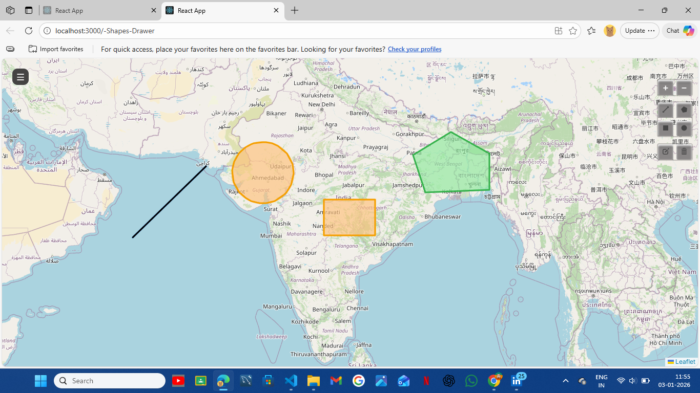
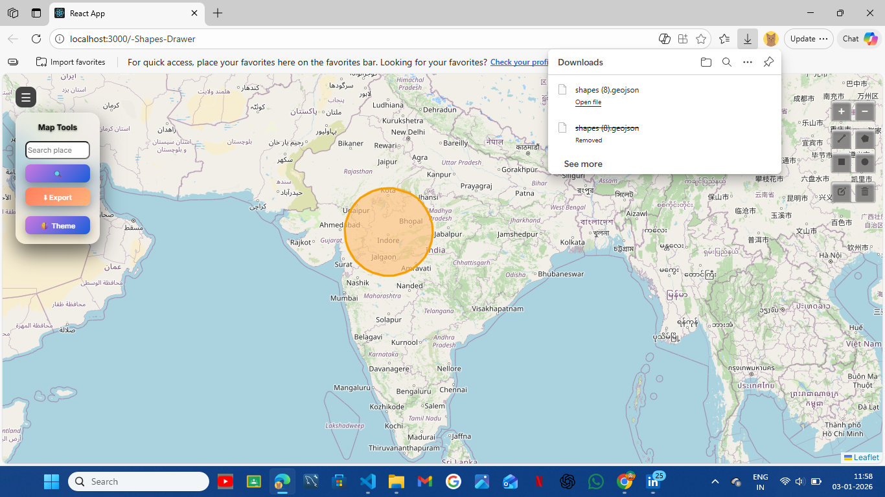
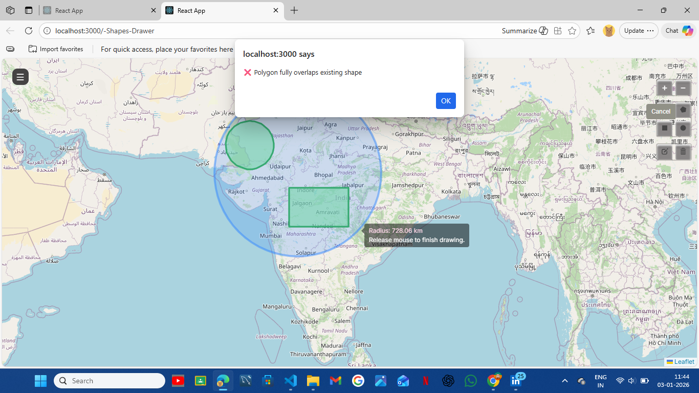

## Setup & Run--

### Install dependencies-
npm install

### Run development server-
npm start

* Clone the repository:-
```bash
 git clone https://github.com/nx-nikita/MapShape-Drawer.git 
 cd MAP-DRAWING-APP

## Polygon Overlap Handling

We use Turf.js for spatial operations.

- `turf.intersect` → detect overlaps
- `turf.difference` → auto-trim overlapping polygons
- `booleanContains / booleanWithin` → detect full enclosure

If a polygon fully encloses another polygon, the action is blocked.
LineStrings are excluded from overlap checks.


### How the logic works:-
. All drawn shapes are stored as GeoJSON features in the application state.
. When a user draws a new shape (polygon, rectangle, or circle), its geometry
   is converted into a GeoJSON feature.

. The new shape is compared with each existing shape using geometry checks:
   - **Polygon vs Polygon**: Intersection and edge overlap checks are performed.
   - **Rectangle vs Rectangle**: Bounding box overlap is validated.
   - **Circle vs Circle**: Distance between centers is compared with the sum of radii.
   - **Mixed shapes**: Geometries are normalized to polygon form before comparison.

. If any overlap or intersection is detected, the new shape is considered invalid.
. The invalid shape is immediately removed, and the user is prevented from
   placing overlapping geometries on the map.


##  Sample GeoJSON Export:-
The application allows users to export all drawn shapes on the map as a
GeoJSON `FeatureCollection`.

Example of an exported GeoJSON object:

```json
{
  "type": "FeatureCollection",
  "features": [
    {
      "type": "Feature",
      "properties": {
        "shapeType": "polygon"
      },
      "geometry": {
        "type": "Polygon",
        "coordinates": [
          [
            [77.5946, 12.9716],
            [77.5952, 12.9721],
            [77.5961, 12.9714],
            [77.5946, 12.9716]
          ]
        ]
      }
    }
  ]
}


## Dependencies:-
- react
- react-dom
- leaflet
- react-leaflet
- leaflet-draw
- typescript

## Dev Dependencies:-
- @types/react
- @types/react-dom
- gh-pages

## Contributing:-
. Create a branch
. Commit changes
. Push and make a Pull Request

## Preview

### Draw Shapes


### Export GeoJSON


### Error Handling



